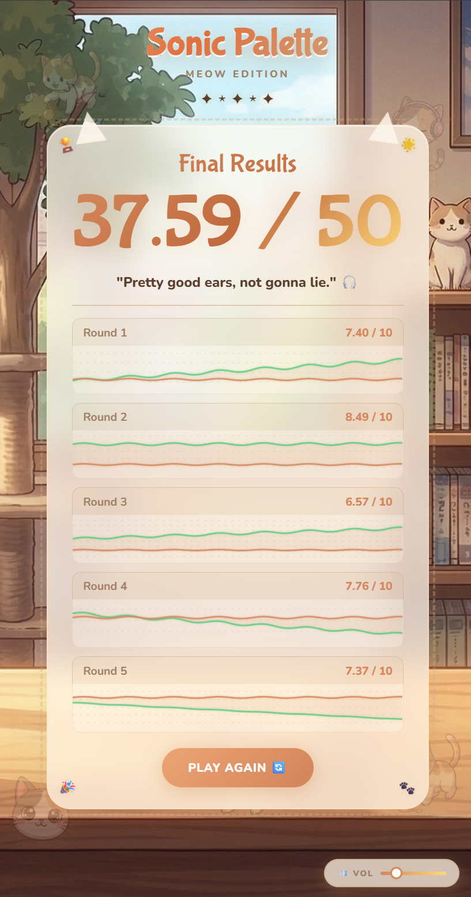
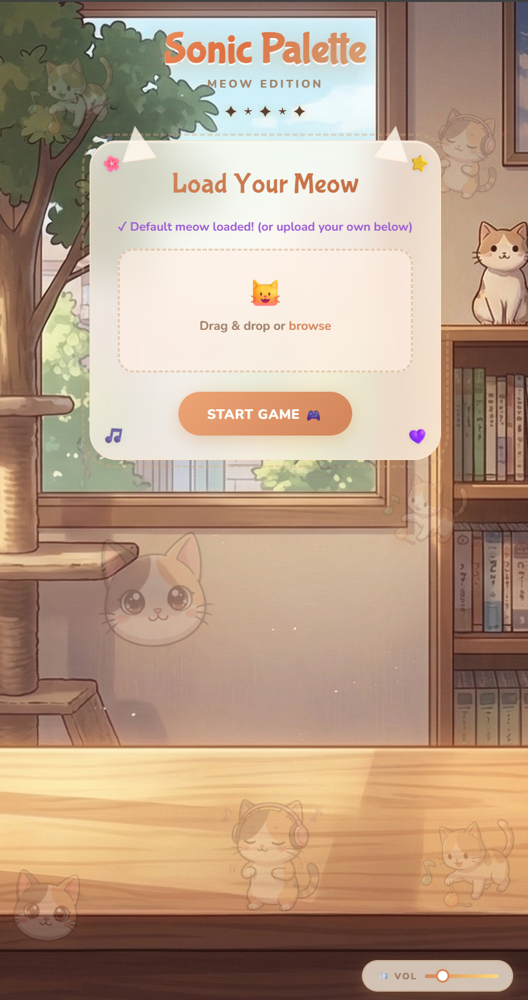
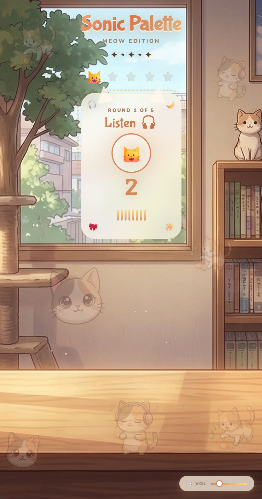
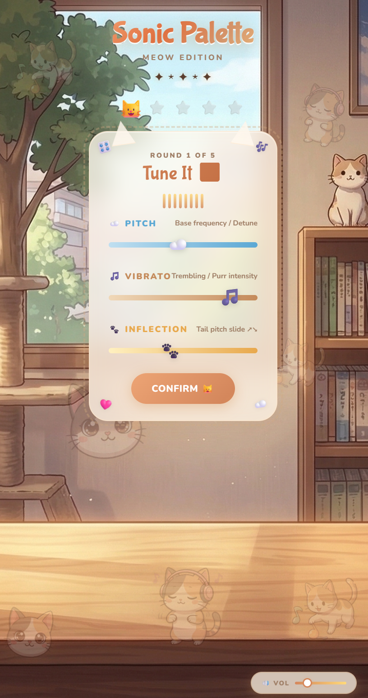
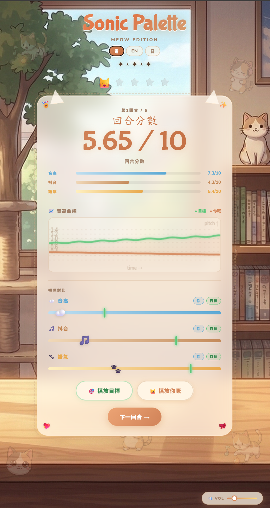

# 🐾 Sonic Palette：喵喵調音師

**一個考你耳仔靈唔靈嘅瀏覽器音頻解謎遊戲。**  
**A browser-based audio puzzle game. Can you tune a cat?**

---

## 🎮 即刻玩 / Play Now

👉 **[https://gamtruliar.github.io/WaveMeow/](https://gamtruliar.github.io/WaveMeow/)**

唔使裝嘢。唔使登記。開頁即玩。  
No install. No sign-up. Just open and play.

---

## 點玩 / How to Play

**廣東話：**

1. 頁面自動載入預設貓叫聲，或者你可以上傳自己嘅音檔。
2. 撳 **Start Game**，專心聆聽 **5 秒**目標聲音。
3. 用三條滑桿，模仿你剛才聽到嘅聲音：
   - **Pitch（音高）** — 低音大肥貓 ←→ 高音細貓仔（速度唔變，純粹變調）
   - **Vibrato（撒嬌抖音）** — 平穩直率 ←→ 強烈顫音撒嬌
   - **Inflection（語氣起伏）** — 尾音下沉警告 ←→ 尾音上揚撒嬌
4. 調到覺得差唔多，撳 **Confirm**。
5. 結算畫面會顯示：
   - 📊 每條滑桿嘅誤差對比（你 vs 目標霓虹綠色標記）
   - 🔢 分數數字動態跳升動畫
   - 🔊 撳 **Play Target** / **Play Yours** 分別聽目標聲同你調嘅聲，親耳確認差幾遠
6. 打完 5 Round，睇你係「耳神」定係「洗耳恭聽」。

---

**English：**

1. The game auto-loads a default meow, or upload your own audio file.
2. Hit **Start Game** — listen carefully for **5 seconds**.
3. Use the three sliders to recreate what you heard:
   - **Pitch** — Low ←→ High (speed stays constant, pure detune)
   - **Vibrato** — Calm & steady ←→ Strong trembling purr
   - **Inflection** — Falling tail tone ←→ Rising curious tone
4. Hit **Confirm** when you think you've matched it.
5. The results screen shows:
   - 📊 Visual slider comparison — your position vs. the target (neon green marker)
   - 🔢 Animated score count-up
   - 🔊 Press **Play Target** / **Play Yours** to compare both sounds
6. Complete **5 rounds** and see your final verdict.

---

## 計分 / Scoring

每條滑桿按照你同目標值嘅距離計分，單項滿分 **10 分**。三條平均係該 Round 分（滿分 10），五 Round 總和係總分（滿分 **50 分**）。  
Each slider scored 0–10 by closeness to the hidden target. Average across three sliders per round (max 10), sum across five rounds (max **50**).

| 總分 Total Score | 稱號 Rank |
|-----------------|----------|
| 47.5+ / 50 | 耳神！Tetrachromat of Sound 🎯 |
| 42.5+ / 50 | 貓語達人 Cat Whisperer 😼 |
| 35+ / 50 | 幾掂喎 Pretty Good Ears 🎧 |
| 25+ / 50 | 合格啦 Decent, Keep Practicing 🐱 |
| 15+ / 50 | 你有冇認真聽？Are You Sure You're Listening? 😐 |
| <15 / 50 | 去洗耳先 Go Wash Your Ears 🚿 |

---

純前端，零依賴。HTML5 + CSS3 + Vanilla JS + Web Audio API。  
Pure front-end, zero dependencies. HTML5 + CSS3 + Vanilla JS + Web Audio API.

---

## 📸 Screenshots

